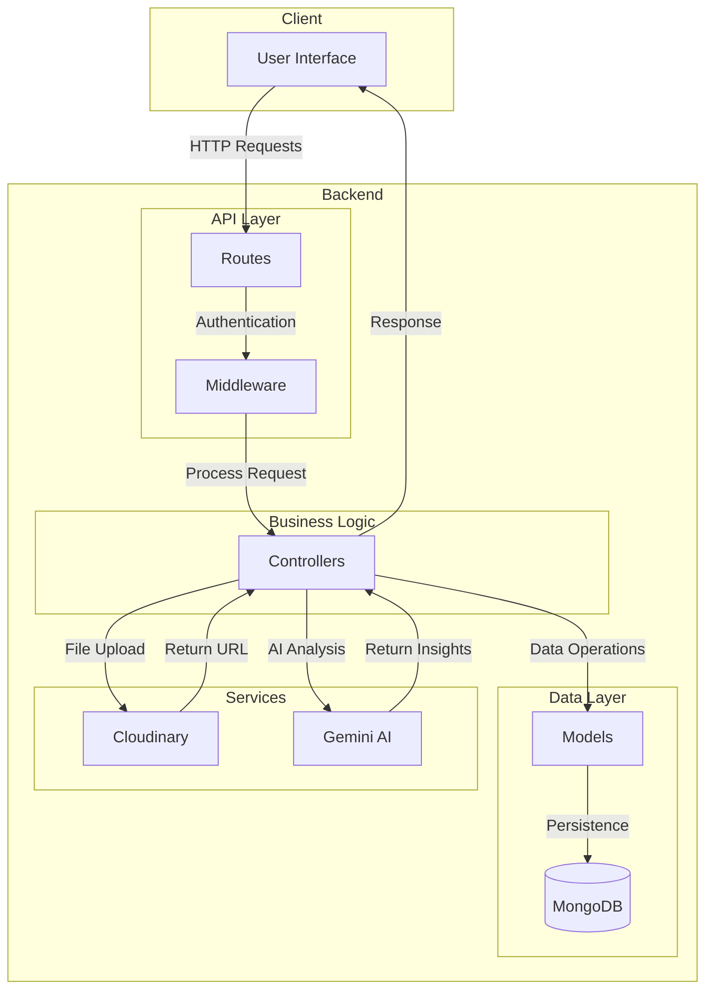
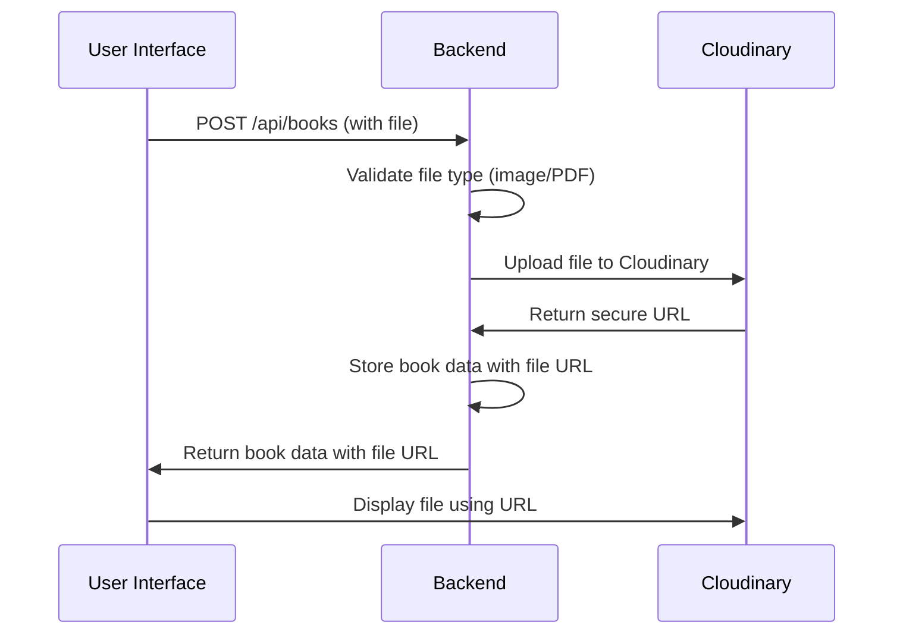

# Book Management System - Backend

## Overview

A robust backend system for managing books with user authentication, file upload capabilities, and integration with Google Gemini AI for book-related insights. Built with Node.js, Express.js, and MongoDB, this system provides RESTful API endpoints for a complete book management experience.

## Architecture



## Features

- **User Authentication**: JWT-based registration and login system
- **Book Management**: Full CRUD operations for books
- **File Upload**: Support for images and PDFs with Cloudinary integration
- **AI Integration**: Google Gemini AI for book analysis and insights
- **RESTful API**: Clean and consistent API design
- **Security**: Protected routes and secure file handling

## Tech Stack

- **Runtime**: Node.js
- **Framework**: Express.js
- **Database**: MongoDB with Mongoose ODM
- **Authentication**: JWT (JSON Web Tokens)
- **File Storage**: Cloudinary
- **AI Service**: Google Gemini AI
- **Environment Management**: dotenv
- **Logging**: Morgan
- **CORS**: Enabled for cross-origin requests

## API Endpoints

### Authentication Routes
| Method | Endpoint | Description |
|--------|----------|-------------|
| POST | `/api/auth/register` | Register a new user |
| POST | `/api/auth/login` | User login |
| GET | `/api/auth/me` | Get current user profile |
| POST | `/api/auth/logout` | Logout user |

### Book Routes
| Method | Endpoint | Description |
|--------|----------|-------------|
| GET | `/api/books` | Get all books |
| GET | `/api/books/:id` | Get single book |
| POST | `/api/books` | Create new book |
| PUT | `/api/books/:id` | Update book |
| DELETE | `/api/books/:id` | Delete book |

## File Upload Flow



## Installation

1. Clone the repository:
   ```bash
   git clone <repository-url>
   cd backend
   ```

2. Install dependencies:
   ```bash
   npm install
   ```

3. Set up environment variables:
   Create a `.env` file in the root directory with the following variables:
   ```
   PORT=5000
   MONGO_URI=mongodb://localhost:27017/Softzia
   JWT_SECRET=your_jwt_secret
   CLOUDINARY_CLOUD_NAME=your_cloudinary_cloud_name
   CLOUDINARY_API_KEY=your_cloudinary_api_key
   CLOUDINARY_API_SECRET=your_cloudinary_api_secret
   GEMINI_API_KEY=your_gemini_api_key
   ```

4. Start the development server:
   ```bash
   npm run dev
   ```

5. The server will be running at `http://localhost:5000`

## Project Structure

```
backend/
├── config/           # Configuration files
│   ├── cloudinary.js # Cloudinary configuration
│   └── geminiConfig.js # Google Gemini AI configuration
├── controllers/      # Request handlers
│   ├── bookController.js
│   └── userController.js
├── middleware/       # Custom middleware
│   ├── authMiddleware.js # Authentication middleware
│   ├── session.js    # Session configuration
│   └── uploadMiddleware.js # File upload handling
├── models/           # Database models
│   ├── bookModel.js
│   └── userModel.js
├── routes/           # Route definitions
│   ├── bookRoutes.js
│   └── userRoutes.js
├── uploads/          # Temporary file storage
├── .env              # Environment variables
├── package.json      # Project dependencies
└── server.js         # Application entry point
```

## Dependencies

### Production Dependencies
- express: ^5.1.0
- mongoose: ^8.18.0
- jsonwebtoken: ^9.0.2
- bcrypt: ^6.0.0
- cloudinary: ^2.7.0
- dotenv: ^17.2.1
- cors: ^2.8.5
- morgan: ^1.10.1
- multer: ^2.0.2
- @google/generative-ai: ^0.24.1

### Development Dependencies
- nodemon: ^3.1.7

## Usage

### Authentication
1. Register a new user:
   ```bash
   curl -X POST http://localhost:5000/api/auth/register \
   -H "Content-Type: application/json" \
   -d '{"username":"testuser","email":"test@example.com","password":"password123"}'
   ```

2. Login:
   ```bash
   curl -X POST http://localhost:5000/api/auth/login \
   -H "Content-Type: application/json" \
   -d '{"email":"test@example.com","password":"password123"}'
   ```

### Book Management
1. Create a new book (with authentication token):
   ```bash
   curl -X POST http://localhost:5000/api/books \
   -H "Authorization: Bearer <JWT_TOKEN>" \
   -H "Content-Type: application/json" \
   -d '{"title":"Sample Book","author":"John Doe","description":"A sample book"}'
   ```

2. Upload a book cover image or PDF:
   Use a multipart form request with the file attached.

## File Upload Guidelines

- Supported image formats: JPG, JPEG, PNG, GIF
- Supported document format: PDF
- Maximum file size: 10MB
- Files are automatically optimized and stored in Cloudinary
- Secure URLs are returned for accessing uploaded files

## Security Features

- JWT authentication with secure token storage
- Password hashing with bcrypt
- Protected routes requiring authentication
- Secure file upload validation
- CORS configuration for controlled access

## Error Handling

The API returns appropriate HTTP status codes and error messages:
- 200: Success
- 201: Created successfully
- 400: Bad request
- 401: Unauthorized
- 404: Resource not found
- 500: Internal server error

## Contributing

1. Fork the repository
2. Create a feature branch
3. Make your changes
4. Add tests if applicable
5. Submit a pull request

## License

This project is licensed under the MIT License.