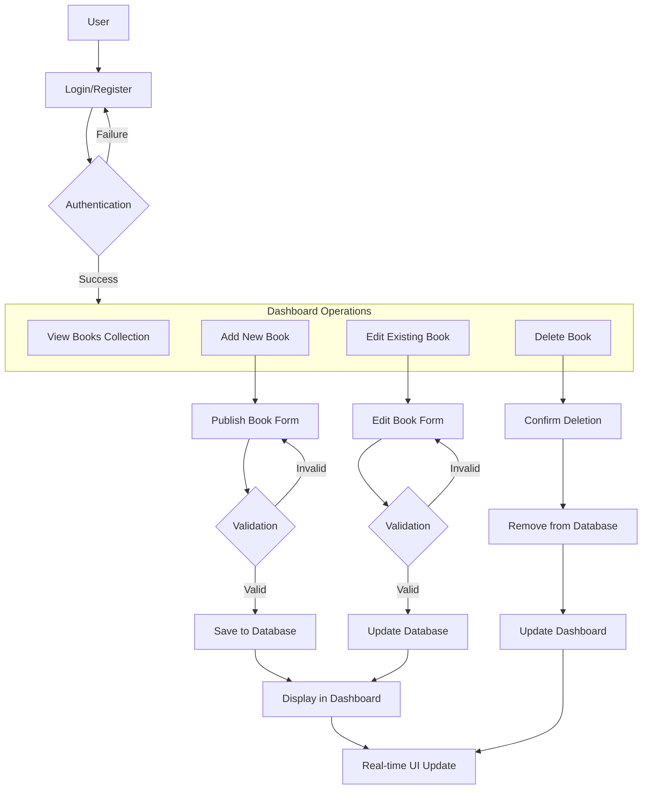

# Book Management System - Frontend

## 🚀 Overview
A modern, responsive web application built with React, TypeScript, and Vite for managing books with a clean, intuitive user interface. This system allows users to authenticate, publish books, and manage their collection through an elegant dashboard.

## 🏗 System Architecture



## 🛠 Tech Stack
- **Framework**: React 18
- **Language**: TypeScript
- **Build Tool**: Vite
- **Styling**: Tailwind CSS with shadcn/ui components
- **State Management**: React Context API
- **Form Handling**: React Hook Form
- **Routing**: React Router
- **HTTP Client**: Axios
- **UI Components**: Radix UI Primitives with shadcn/ui

## 📁 Project Structure
```
frontend/
├── public/              # Static assets
├── src/
│   ├── api/             # API service layer
│   ├── assets/          # Images, fonts, etc.
│   ├── components/      # Reusable UI components
│   │   ├── auth/        # Authentication components
│   │   ├── dashboard/   # Dashboard components
│   │   ├── books/       # Book-related components
│   │   └── ui/          # Base UI components
│   ├── contexts/        # React contexts (Auth, Books, etc.)
│   ├── hooks/           # Custom React hooks
│   ├── pages/           # Page components
│   │   ├── Login/       # Login page
│   │   ├── Register/    # Registration page
│   │   ├── Dashboard/   # Main dashboard
│   │   └── BookForm/    # Add/Edit book form
│   ├── styles/          # Global styles
│   ├── types/           # TypeScript type definitions
│   ├── utils/           # Utility functions
│   ├── App.tsx          # Main App component
│   └── main.tsx         # Application entry point
├── .env                 # Environment variables
├── package.json         # Project dependencies
└── tsconfig.json        # TypeScript configuration
```

## 🚀 Getting Started

### Prerequisites
- Node.js (v16+)
- npm or yarn

### Installation
1. Clone the repository
2. Navigate to the frontend directory:
   ```bash
   cd frontend
   ```
3. Install dependencies:
   ```bash
   npm install
   # or
   yarn
   ```

```

### Available Scripts
```bash
# Start development server
npm run dev

# Build for production
npm run build

# Preview production build
npm run preview

# Lint code
npm run lint
```

## 🌟 Features
- **User Authentication**: Secure login/register system with JWT tokens
- **Book Management**: Full CRUD operations for books
- **Responsive Design**: Works seamlessly on desktop, tablet, and mobile
- **Form Validation**: Comprehensive validation for all forms
- **Toast Notifications**: User feedback for actions
- **Protected Routes**: Authentication-required routes
- **File Uploads**: Support for book cover images
- **Real-time Updates**: Instant UI updates after operations

## 📖 User Flow
1. **Authentication**: User logs in or registers for an account
2. **Dashboard Access**: Upon successful authentication, user is redirected to dashboard
3. **Book Management**:
   - **Add Book**: User clicks "Add Book" button, fills form, and publishes
   - **View Books**: Published books appear in the dashboard grid
   - **Edit Book**: User can modify book details through edit form
   - **Delete Book**: User can remove books with confirmation
4. **Persistent Data**: All changes are saved to database and reflected in real-time

## 🧪 Testing
To run tests:
```bash
npm test
```

## 🚀 Deployment
The application can be deployed to any static hosting service:
- Vercel
- Netlify
- GitHub Pages
- Or any static file server

Build the project first:
```bash
npm run build
```

Then deploy the `dist` folder to your preferred hosting platform.

## 📚 Dependencies
### Main Dependencies
- @radix-ui/react-*: Primitive UI components
- @hookform/resolvers: Form validation
- axios: HTTP client
- react-hook-form: Form handling
- react-router-dom: Routing
- tailwindcss: Utility-first CSS framework

### Development Dependencies
- @types/*: TypeScript type definitions
- @vitejs/plugin-react: Vite plugin for React
- eslint: Code linting
- jsdom: Testing environment
- vite: Build tool

## 🤝 Contributing
1. Fork the repository
2. Create your feature branch (`git checkout -b feature/AmazingFeature`)
3. Commit your changes (`git commit -m 'Add some AmazingFeature'`)
4. Push to the branch (`git push origin feature/AmazingFeature`)
5. Open a Pull Request

## 📝 License
This project is licensed under the MIT License - see the [LICENSE](LICENSE) file for details.

## 🆘 Support
For support, please open an issue in the GitHub repository or contact the development team.

---

**Happy Reading and Book Management!** 📚✨